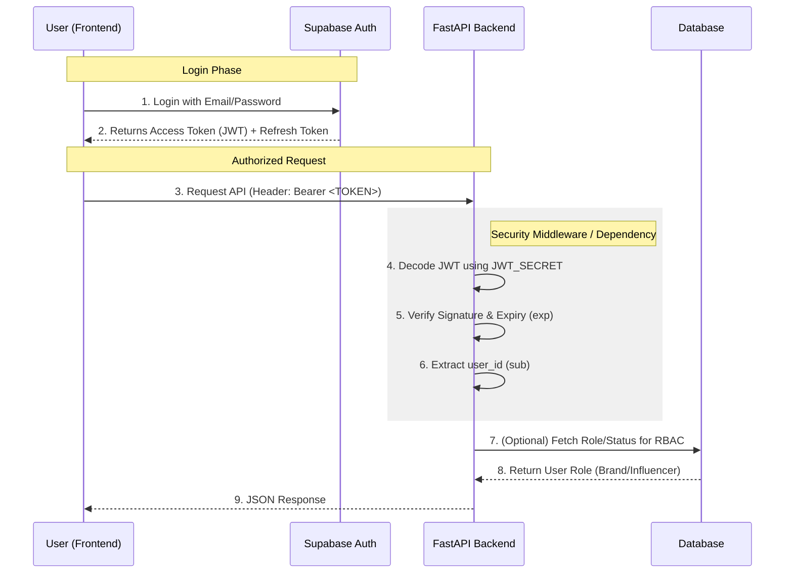

# Authentication & Authorization Architecture

## Authentication Flow (JWT)

We use **Supabase Auth** as the Identity Provider (IdP). The Backend **never** handles passwords.

## Security Pitfalls to Avoid

| Pitfall | Solution |
| :--- | :--- |
| **Trusting the Frontend** | Never rely on the frontend saying "I am an Admin". Always verify the JWT signature on the backend. |
| **Ignoring Expiry (`exp`)** | Always check if the token is expired. `python-jose` handles this, but configuration must be correct. |
| **Weak Secrets** | The `JWT_SECRET` must be a high-entropy string (generated by Supabase). If leaked, attackers can forge admin tokens. |
| **Scope Creep** | Don't accept a standard User token for Admin routes. Enforce explicit `role="admin"` checks. |
| **Leaking Errors** | Don't return "Invalid Signature" or "User not found" explicitly in production to avoid enumeration attacks. Return generic 401. |

## Role Key
- `anon`: Unauthenticated.
- `authenticated`: Logged in, basic access.
- `brand`: Can create campaigns.
- `influencer`: Can view campaigns & receive payments.
- `admin`: Full system access.
