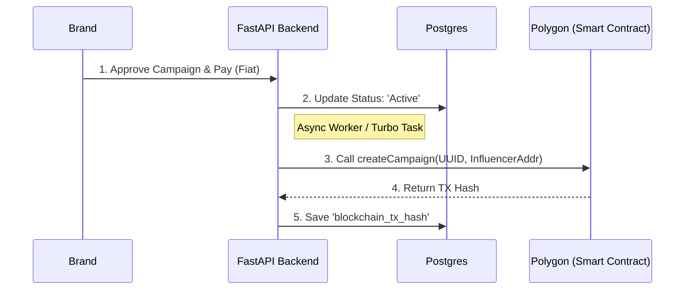

# Blockchain Integration Strategy

## 1. Philosophy: "Backend as the Custodian"
We abstract the blockchain complexity away from users.
- **Brands** pay via Credit Card (Razorpay).
- **InfluencerHub** (Backend) creates an on-chain record using its own Treasury Wallet.
- **Influencers** receive Crypto (Optional) or just get the "Verified Record" on-chain for reputation.

## 2. Component Responsibilities

### Smart Contract (`InfluencerEscrow.sol`)
- **State Machine**: Tracks `Locked` -> `Released` states.
- **Immutable Record**: Stores the `UUID` of the campaign provided by Postgres.
- **Vault**: Holds MATIC (if crypto payouts are enabled).
- **Security**: Access controlled by `onlyAuthority` modifier (The Backend).

### Backend Service (`services/blockchain/service.py`)
- **Wallet Manager**: Loads `WALLET_PRIVATE_KEY` securely from env.
- **Signer**: Signs transactions locally (offline signing) and broadcasts to Polygon RPC.
- **Mapper**: Maps Postgres `campaign_id` to Blockchain `tx_hash`.

## 3. Flow Diagram

## 4. Security Considerations

| Risk | Mitigation |
| :--- | :--- |
| **Private Key Leak** | NEVER commit keys to Git. Use Secret Managers (AWS/GCP) in prod. |
| **Nonce collisions** | Use a queue (Redis/Celery) for blockchain transactions to prevent nonce errors if users spam actions. |
| **Gas Spikes** | Set hard gas limits in code. If gas > X, delay transaction. |

## 5. What NOT to do (Anti-Patterns)

- ❌ **Do NOT ask users to install Metamask**. This kills conversion rates for Web2 brands.
- ❌ **Do NOT wait for Block Confirmations strictly inline**. 
    - *Bad*: User waits loading spinner for 30s. 
    - *Good*: Return "Processing", update UI via WebSocket/Polling later.
- ❌ **Do NOT store Private Data on-chain**.
    - Store `Campaign ID` (UUID). NOT "Pepsi Campaign for $500". Code is public; anyone can see input params.
