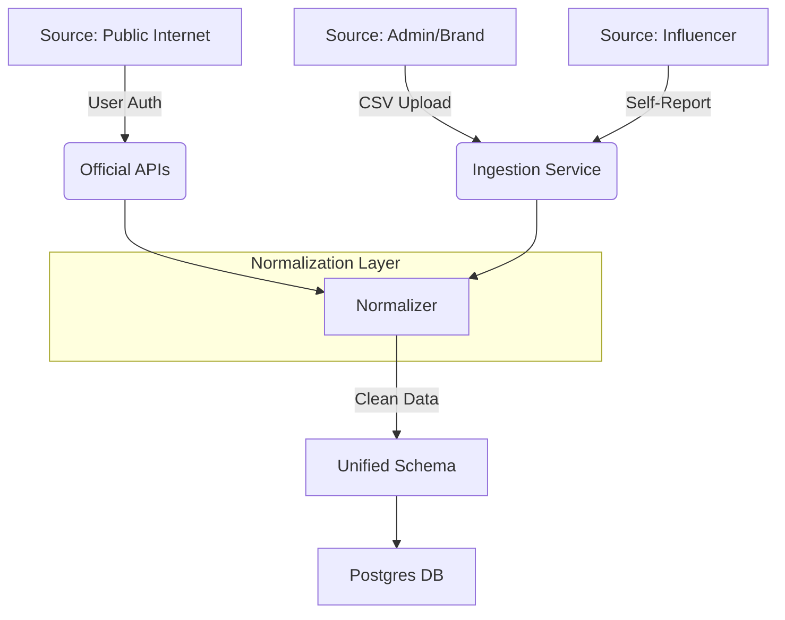

# Data Ingestion Strategy

## Philosophy: "Verified & Safe"
We prioritize **Data Safety** and **Compliance** over Volume using a "User-Centric" approach.
**Rule #1**: We do NOT scrape. Scraping violates ToS of Instagram/LinkedIn and risks IP bans.

## 1. Data Flow

## 2. MVP Approach (High Impact, Low Risk)

### A. Manual "Self-Verification" (Primary)
The most accurate data comes from the creators themselves.
1.  **Influencer signs up**.
2.  User manually enters: "I have 50k followers on IG".
3.  **Verification**: User uploads a screenshot OR connects via OAuth (Stage 2).
4.  **Fallback**: Admin/Brand bulk uploads CSV of known influencers.

### B. CSV Bulk Ingestion
For seeding the database with initial talent.
- **Format**: `handle, platform, followers, url, niche_tags`
- **Validation**: Strict Pydantic checks (URLs must be valid, counts must be positive).
- **Handling Missing Data**: 
    - If `engagement_rate` is missing, default to `null` (don't guess).
    - If `tags` are missing, flag for AI enrichment later.

### C. Official APIs (Safe Automated)
1.  **YouTube Data API v3**:
    - **Status**: ✅ Safe & Free (up to quota).
    - **Data**: Channel stats (subs, views), video descriptions.
    - **Auth**: API Key (Server-side) or OAuth (User-side).
2.  **Instagram Basic Display API**:
    - **Status**: ⚠️ Requires App Review/User Auth.
    - **MVP**: Skip. Rely on user self-report.
3.  **LinkedIn**:
    - **Status**: ⛔ Closed API.
    - **Strategy**: Manual link submission only.

## 3. Normalization Strategy
All incoming data maps to `NormalizedInfluencerData`.

| Source Field | Normalized Field | Notes |
| :--- | :--- | :--- |
| `ig_handle` / `channel_title` | `display_name` | |
| `subscriberCount` | `follower_count` | Standardized to integer |
| `like_count / view_count` | `engagement_rate` | Calculated: (Likes + Comments) / Followers |
| `video_tags` | `tags` | Used for AI matching |

## 4. Future Automation
1.  **OAuth Integration**: "Login with Instagram" to auto-fetch insights.
2.  **Webhooks**: Listen for updates (e.g. YouTube "New Video" notifications) to update metrics real-time.
3.  **AI Enrichment**: Use LLMs to analyze Bio/Descriptions and auto-generate clean `tags` if missing.
