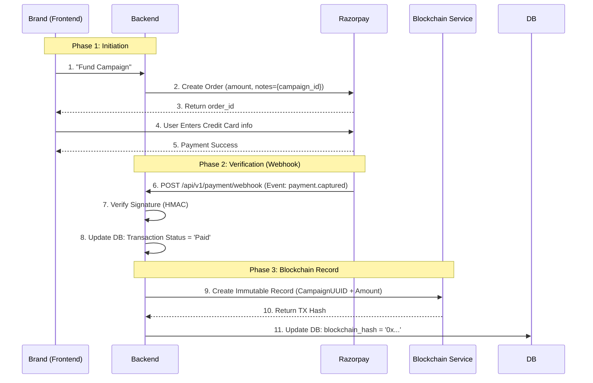

# Payment & Settlement Flow

## 1. Flow Overview
We use a **Two-Phase Commit** strategy where the Blockchain recording happens *only* after a successful Fiat payment is confirmed via Webhook.

## 2. Webhook Handling Logic
**Endpoint**: `/api/v1/payment/webhook`

1.  **Read Headers**: Extract `X-Razorpay-Signature`.
2.  **Verify**: Compute `HMAC_SHA256(payload, secret)`. If dispatch != signature, **ABORT** (400 Bad Request). This prevents attackers from faking payments.
3.  **Idempotency**: Check if `payment_id` already exists in `transactions` table. If yes, return 200 OK (ignore duplicate).
4.  **Process**:
    -   Parse `payload.payment.entity.notes.campaign_id`.
    -   Update Campaign status to `ACTIVE`.
    -   Trigger Background Task: `blockchain_service.create_record(...)`.

## 3. Failure Scenarios

| Scenario | Handling |
| :--- | :--- |
| **User closes window after paying** | No impact. The **Webhook** is server-to-server and reliable. |
| **Blockchain Transaction Fails** | Payment is effectively "captured" in Fiat but missing on-chain.   **Mitigation**: A nightly Cron Job scans for 'Paid' transactions with `blockchain_hash=NULL` and retries the blockchain write. |
| **Webhook delayed** | The UI polls the status every 5s. Eventually, the status flips to 'Paid'. |

## 4. Security Criticals
- **Never trust the Frontend success callback** for fulfilling the order. An attacker can manipulate client-side JS to call `onSuccess()`.
- **Always use Webhooks** as the source of truth for money.
